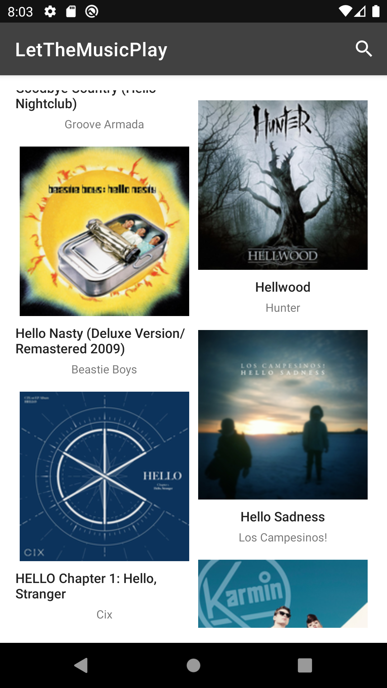
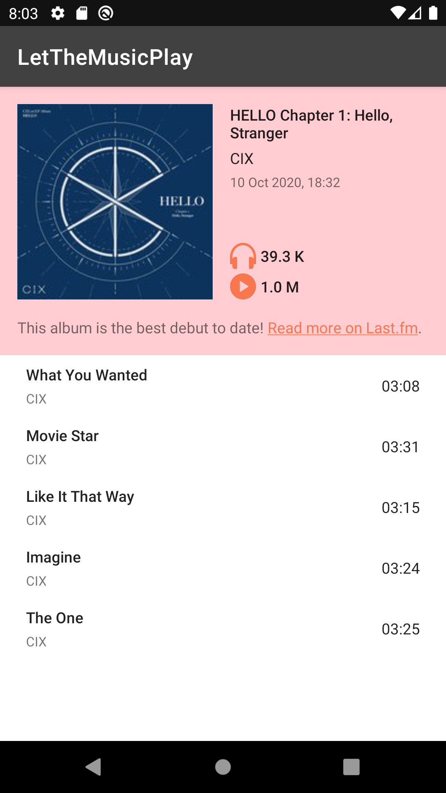
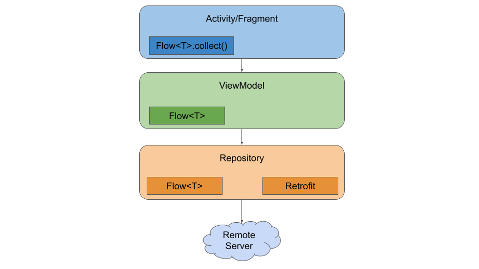
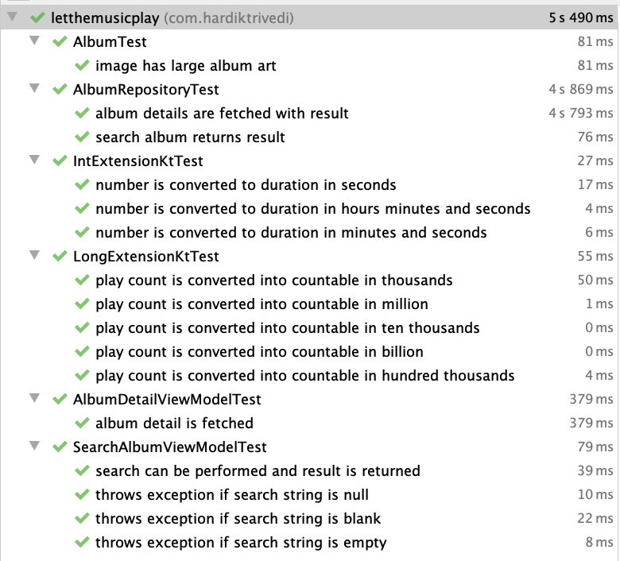
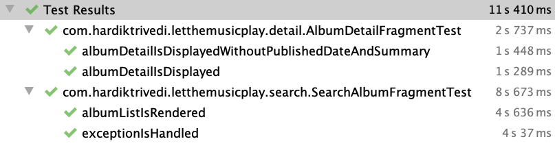

# LetTheMusicPlay
A demo android application which allow user to search and loads the music album from remote server. 
On click of album list item user can navigate to detail screen. It demonstrates several aspect of Android application development.
The code is fully written in [Kotlin](https://kotlinlang.org/)
---

| Album list | Album detail |
| ----------- | ----------- |
|  |  |

## Application architecture
Google recommended [app development architecture](https://developer.android.com/jetpack/guide) is followed. 
For this architecture [ViewModel](https://developer.android.com/topic/libraries/architecture/viewmodel) is at the core of an architecture. 
ViewModel is lifecycle aware and hence provides a great benefit when it comes to controlling view, data and asynchronous tasks.
Check the following diagram which explains that each component in dependent on it's lower level component. e.g. Activity/Fragment is dependent on it's ViewModel.
A ViewModel is connected to repository. Repository's sole responsibility it to provide data from remote server.

## Why architecture component?
- ViewModel is lifecycle aware and when Activity/Fragment is destroyed recreating and achieving the old state comes very easy.
- Repository separates the concern and provide clear way of handling data. With little refactoring A repository can support fetching data from both local and remote data source. So caching becomes easy.
- Hilt which is a new dependency injection(built on top of Dagger) framework has out of the box supports for ViewModel. 
- Great support for implementing pagination, background jobs, navigation, local storage and data binding.

## Testing approach
It is very important how user is going to interact with your application. Writing test cases gives assurance that application is stable and safe for your user.
It allows you to refactor code easily.
It captures business requirements in form of test cases.

| Unit Test | Espresso Test |
| ----------- | ----------- |
|  |  |

- **Run unit test:** `./gradlew :app:test`
- **Run espresso test:** `adb shell am instrument -w -m  --no-window-animation  -e package com.hardiktrivedi.letthemusicplay -e debug false com.hardiktrivedi.letthemusicplay.test/com.hardiktrivedi.letthemusicplay.LetTheMusicPlayTestRunner`

**Note: To get consistent result of espresso UI tests, make sure you disable animation on your emulator**

## Libraries used
| Library name | Purpose |
| ----------- | ----------- |
| [Hilt](https://developer.android.com/training/dependency-injection/hilt-android) | Reduces the boilerplate of doing manual dependency injection |
| [Retrofit](https://square.github.io/retrofit/) | A type-safe HTTP client for Android  |
| [JUnit](https://junit.org/junit4/) | Testing framework which runs test cases on JVM  |
| [Espresso](https://developer.android.com/training/testing/espresso) | To write concise, beautiful, and reliable Android UI tests |
| [Mockk](https://mockk.io/) | Mocking library for Kotlin  |
| [Mock Webserver](https://github.com/square/okhttp/tree/master/mockwebserver) | Mocking network calls while running UI tests |
| [Flow](https://kotlinlang.org/docs/flow.html) | Manage data stream asynchronously |
| [Picasso](https://square.github.io/picasso/) | A powerful image downloading and caching library for Android  |
